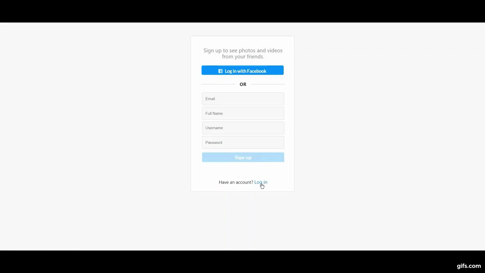
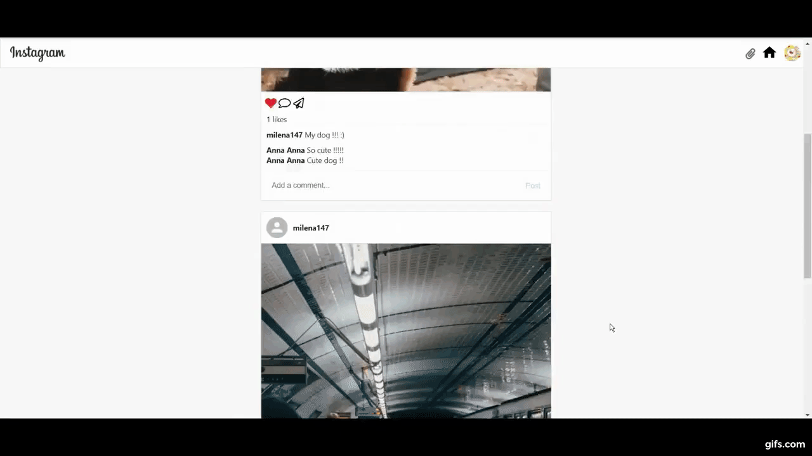

# Instagram-website-clone
<strong> A full stack project with React and Firebase </strong>

<ul>
  <strong>React.js : </strong>
  <li>React hooks: useState() and useEffect().</li>
  <li>React Router. </li>
  

  <li>Material-ui. </li>
  <li>Semantic-ui. </li>  
</ul>

<ul>
  <strong>Firebase : </strong>
  <li>Firebase Authentication.</li>
  <li>Cloud Firestore - NoSQL cloud database.</li>
  <li>Log in with Facebook.</li>
</ul>
  
<a href="https://youtu.be/I2K_TXAikXQ">Youtube Demo</a> 

